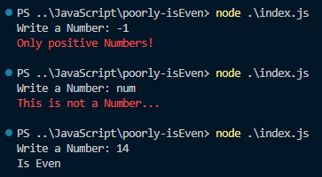
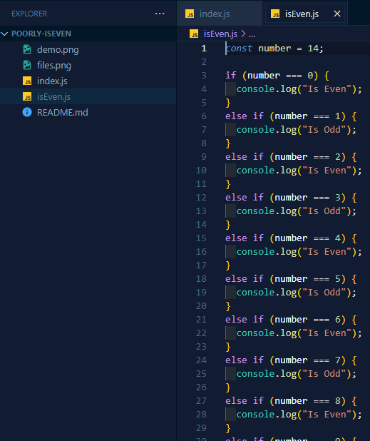

# Poorly isEven File

A Code that creates a file called isEven.js with lots of if & else

## Why?

It all started when I watched a [video](https://www.youtube.com/watch?v=PCm5Gi0vMGA) from the channel [Theo - t3.gg](https://www.youtube.com/@t3dotgg), where the creator of the post, Andreas, created a program that generated a bunch of if and else statements to check whether a number was even or odd in the most optimized way possible.

- [Blog Post](https://andreasjhkarlsson.github.io//jekyll/update/2023/12/27/4-billion-if-statements.html)

- [Github](https://github.com/andreasjhkarlsson)

My program isn't even close to being as optimized, it's the first time I've tried to use file creation with pure Node.js, reasons:

1. Node is just not for this
2. I really don't tried to optimized this much

and to be quite honest, this was actually fun to make :)

## Examples

Ah, for anyone reading this the limit, at least on my computer, is 1636.