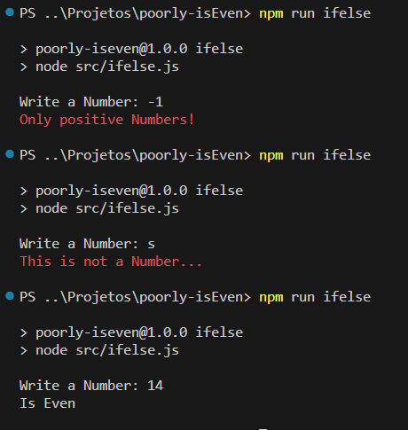
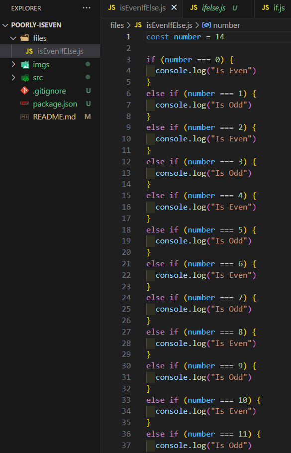

# Poorly isEven File

A code that creates a file called isEven with many if statements in the "files" directory.

## Why?

It all started when I watched a [video](https://www.youtube.com/watch?v=PCm5Gi0vMGA) from the channel [Theo - t3.gg](https://www.youtube.com/@t3dotgg), where the creator of the post, Andreas, created a program that generated a bunch of if and else statements to check whether a number was even or odd in the most optimized way possible.

- [Blog Post](https://andreasjhkarlsson.github.io//jekyll/update/2023/12/27/4-billion-if-statements.html)

- [Github](https://github.com/andreasjhkarlsson)

My program isn't even close to being as optimized, it's the first time I've tried to use file creation with pure Node.js, reasons:

1. Node is just not for this
2. I really don't tried to optimized this much

and to be quite honest, this was actually fun to make :)

## Commands

Create a file with only if()

    npm run if

Create a file with only if() and else()

    npm run ifelse

Create a file with only switch()

    npm run switch

## Examples

# Limits
You may need to enter the values little by little like: 5000000, 10000000, 15000000

| File    | Limit    |
|---------|----------|
| If      | 15000000 |
| Switch  | 10000000 |
| If Else | 1636     |

_the limits are still being tested_
